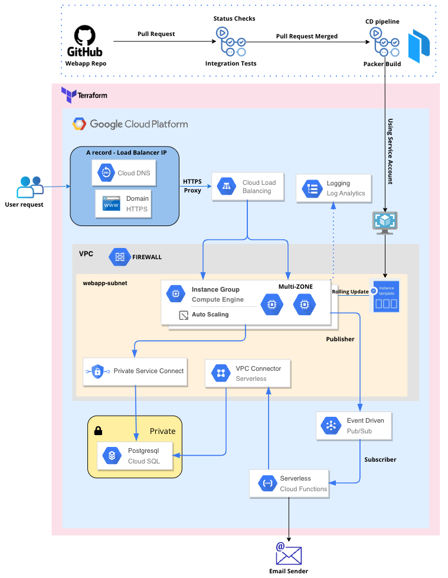

# Project Overview

This project encompasses a multi-component architecture that leverages various Google Cloud Platform (GCP) services to deploy a robust web application. The system integrates continuous deployment, infrastructure as code, and serverless functions to ensure scalability, security, and efficient development workflows.

## Repositories Overview

The project is divided into several repositories, each handling a specific segment of the architecture:

- **Webapp**: Contains the code for the REST API web application. It uses GitHub Actions to automate the continuous deployment process, which includes building an VM Image using Packer on Google Cloud VMs. The resulting image is used to refresh the instance group through a new instance template.

- **Terraform-IAC**: Manages the infrastructure setup and modifications using Terraform as the infrastructure as code tool. It ensures infrastructure versioning and repeatability.

- **Serverless**: Hosts the JavaScript function code for a Google Cloud Function that sends verification emails to users upon registration.

## Infrastructure Components

### Network and Security

### Google Cloud Platform

- **Cloud DNS**: Manages the domain's DNS settings and points the A record to the Load Balancer IP.
- **HTTPS Proxy & Cloud Load Balancing**: Directs user requests to the appropriate resources while handling SSL termination for secure HTTPS traffic.
- **VPC with Firewall (webapp-subnet)**: A secure virtual network with firewall rules that host the application resources.
- **Instance Group & Compute Engine**: A group of virtual machine instances that serve the web application, equipped with auto-scaling and multi-zone deployment for high availability.
- **Private Service Connect**: Enables private connectivity to GCP services.
- **Cloud SQL (PostgreSQL)**: Fully-managed database service that hosts the application's data securely within a private network.

### Continuous Integration / Continuous Deployment (CI/CD)

- **Integration Tests**: Automated tests that run to ensure the application behaves as expected after changes.
- **Packer Build**: Builds immutable images based on the application code and dependencies for reliable deployments.

### Security and Monitoring

- **Unprivileged Service Account**: A least-privilege account used by the CI/CD pipeline to enhance security.
- **Logging & Log Analytics**: Collects and analyzes logs to monitor the health and security of the application.

### Serverless and Event-Driven Architecture

- **VPC Connector**: Connects serverless products to the VPC network.
- **Pub/Sub**: A messaging service for event-driven systems which decouples services that produce events from services that process them.
- **Cloud Functions**: Lightweight compute solution for creating event-driven applications and connects to the Pub/Sub for processing events.
- **Email Sender**: An example serverless function that triggers sending emails in response to specific events.

## Deployment Strategy

- **Rolling Updates**: The application is updated with zero downtime by gradually replacing instances with new ones.
  
- **Domain Name**: Acquired through Hostinger.
- **DNS and SSL**: A public DNS zone hosted on Google Cloud with an A record pointing to a Load Balancer IP. SSL certificates are managed by Google Cloud.
- **VPC Configuration**: Includes a public subnet, all hosted within the US-East1 region. VMs are placed in a public subnet. Con

### Compute and Storage

- **Instance Group**: Utilizes a custom AMI and supports autoscaling and health checks. The group is deployed across three zones in the US-East1 region to ensure high availability.
- **SQL Database**: An SQL DB instance is deployed within Google's VPC and is accessible from the VMs via VPC peering.
- **Bucket Storage**: A dedicated bucket is used for storing serverless artifacts.
- **Encryption**: A customer-managed key stored in a key ring is used to encrypt the disks of VMs, the SQL instance, and the bucket.

### Event-Driven Components

- **Google Cloud Pub/Sub**: Facilitates the communication between the webapp and the serverless function. When the `/v1/user` endpoint is hit, a message is posted to a Pub/Sub queue, which then triggers the email verification function.
- **Google Cloud Function**: Responsible for sending an email verification to users. The email includes a link that expires in 2 minutes.

## Setup and Deployment Instructions

### Prerequisites

1. Google Cloud Platform account.
2. Configured gcloud CLI and Terraform on your local machine.
3. Access to a Namecheap account for domain management.

### Configuration Steps

1. **Clone the Repositories**: Each component of the project has its own repository. Ensure you clone each repository:
   - `git clone <webapp-repo-url>`
   - `git clone <terraform-IAC-repo-url>`
   - `git clone <serverless-repo-url>`

2. **Set Up Infrastructure**: Navigate to the Terraform-IAC repository and initialize the Terraform configuration:
 - `cd Terraform-IAC`
 - `terraform init`
 - `terraform apply`

3. **Deploy the Webapp**: Follow the continuous deployment setup in the Webapp repository to link GitHub Actions with your GCP account.

4. **Configure and Deploy Serverless Functions**: Use the instructions in the Serverless repository to deploy the functions via Google Cloud Functions.

### Monitoring and Management

Utilize Google Cloud's monitoring tools to track application performance and health. Set up alerts for critical performance metrics and system anomalies.

## Support and Contributions

For support, please open an issue in the respective repository. Contributions are welcome through pull requests. Ensure that you follow the contribution guidelines specified in each repository.

---
This README serves as an overview guide to setting up and understanding the project's infrastructure and components. For detailed setup instructions or troubleshooting, refer to the documentation within each repository.
